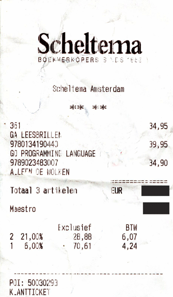

# Visit to the Book Store

On Saturday, 29 September 2018, Jim went to visit his favorite book store in Amsterdam: Scheltema, located on Rokin. Scheltema has a great collection of fiction, non-fiction and scientific literature. And, not unimportantly, an extensive collection of books on IT.

After looking around a bit, Jim left the book store with a new set of reading glasses, a book on the Go Programming Language and a history book on the Interbellum in Europe, i.e. the period between the First and Second World War.

The receipt is shown below (prices in Euros).

## Assignment

First solve the exercises below manually, using pen and paper. Or use a spreadsheet if you like. Then try to solve them by writing a JavaScript program.

Assume the following:

- The BTW on books is 6%.
- The regular BTW is 21%.
- €1 = $1.17

Exercise questions:

1. What is the total Euro price incl. BTW and excl. BTW?
2. If these items could be bought tax free, what would be the total price in US dollars?
